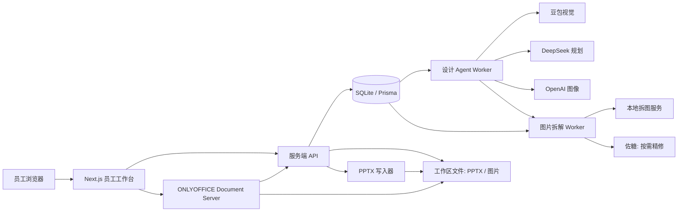
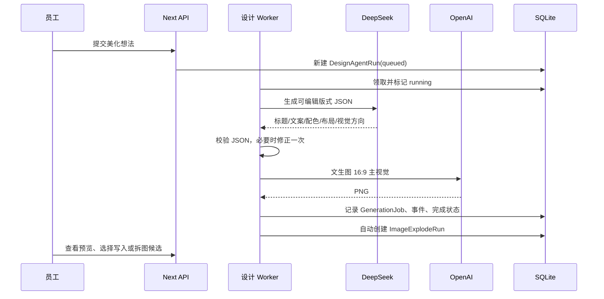
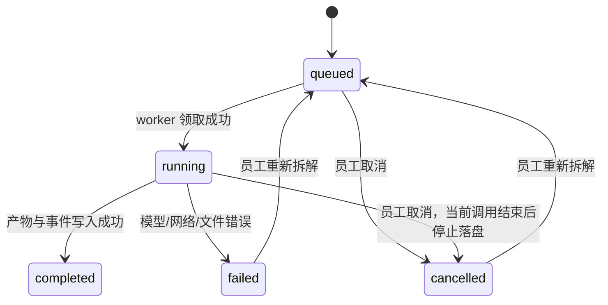
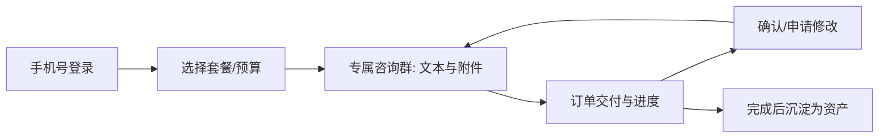
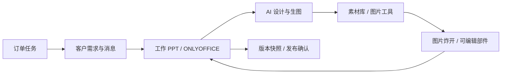

# WZLCF 智能体与全站产品工程复盘

> 本文基于当前仓库的实际实现、最近的“智能美化 → 图片炸开 → 写入 PPT”迭代编写。它不是宣传稿：已实现、部分实现和尚未实现的能力会明确区分。

## 先给结论

当前的“PPT 智能美化”**可以称为一个面向明确任务的、多模型工作流智能体**，但它还不是一个足够成熟的“自主设计智能体”。

它已经具备智能体最关键的骨架：理解输入、调用不同模型和工具、保存任务状态、异步执行、失败降级、让人确认后写入真实 PPT 文件。它不是一个只会聊天或只会调用一次生图接口的功能。

但它还缺少几项成熟智能体应有的能力：可量化的结果评审、可沉淀的长期设计记忆、基于反馈的自我改进、可靠的工具质量评分，以及更强的任务恢复/可观测性。因此更准确的名称是：

> **以员工为决策者的人机协作式 PPT 设计 Agent。**

它负责把“需求 → 视觉理解 → 版式计划 → 预览 → 可编辑部件 → PPT 页面”串起来；员工仍然负责选择、审美判断和最终交付。

---

## 1. 它是不是智能体？

### 1.1 不同层次的“AI 功能”

| 层级 | 例子 | 当前项目的位置 |
| --- | --- | --- |
| 单点 AI 调用 | 输入一句话，生成一张图片 | 项目不止于此 |
| AI 工作流 | 固定顺序调用 A、B、C | 当前项目已具备 |
| 任务型 Agent | 有状态、能选择工具、能处理失败、让人确认 | 当前项目已部分具备 |
| 自主 Agent | 自己设目标、评估质量、反复改进、长期学习 | 当前还没有 |

当前智能体有明确的任务边界：“为某个订单产出一张可编辑的 PPT 美化方案/部件候选”。它可以根据模式选择是否调用视觉模型，调用规划模型和图像模型，记录阶段事件，遇到 OpenAI 参考图安全拒绝时自动降级为“风格摘要生图”，随后自动触发图片拆解。这个行为已经超出普通聊天框。

但它的“规划”仍是预设流水线：混合模式固定走豆包 → DeepSeek → OpenAI；文生图固定跳过豆包。它不会自己判断“这张图不适合炸开，应该先问员工一个问题”，也不会依据员工最终接受/拒绝结果自动调整下一次设计。因此不能夸大成通用自主智能体。

### 1.2 当前智能体的组成，对照标准 Agent 结构

| Agent 常见模块 | 当前实现 | 真实状态 |
| --- | --- | --- |
| 用户意图 | 员工填写美化想法、选择文生图/混合模式、选择参考图 | 已实现 |
| 上下文 | 订单标题、员工原话、素材库、PPT 提取图、参考图 | 已实现 |
| 视觉理解 | 豆包 `doubao-seed-2-0-pro-260215` 分析参考图 | 已实现，混合模式使用 |
| 规划器 | DeepSeek V4 Pro 输出结构化版式 JSON | 已实现 |
| 记忆 | SQLite 中的订单、任务、事件、参考图、生成结果 | 有“业务记忆”，没有偏好型长期记忆 |
| 知识库/RAG | 当前主要靠提示词和订单上下文 | 未形成正式设计知识库 |
| 工具调用 | OpenAI 生图、豆包视觉、ONLYOFFICE、PPTX 写入、佐糖、拆图服务 | 已实现 |
| 执行器 | 独立 Node worker，轮询数据库任务 | 已实现 |
| 结果校验 | DeepSeek JSON 解析失败时修正一次；图片安全降级 | 有基础校验，缺少质量评审 |
| Guardrails | 登录、订单归属、文件限制、频率限制、密钥服务端保存、JWT | 已有基础安全边界 |
| Tracing | Run / Event / 状态 / 错误 / 开始结束时间 | 已实现基础追踪，未接入专业 tracing 平台 |

---

## 2. 智能体总体架构

### 2.1 三个关键原则

1. **浏览器不持有密钥。** OpenAI、方舟、佐糖密钥只由服务端读取 `.env`。
2. **耗时任务不阻塞网页。** 前端创建任务后轮询状态；worker 从数据库领取任务执行。
3. **PPT 是正式产物，不是截图。** 最终写入的是 PPTX 包里的原生图片对象和文本框，ONLYOFFICE 负责在线编辑。

### 2.2 主要代码位置

| 范围 | 关键文件 |
| --- | --- |
| 智能美化前端 | `components/employee-app.tsx` 的 `DesignStudio` |
| 智能美化 API | `app/api/employee/services/[id]/design-agent/runs/` |
| 设计执行器 | `scripts/design-agent-worker.mjs` |
| 图片炸开前端 | `components/employee-app.tsx` 的 `ImageExplodeStudio` |
| 图片拆解执行器 | `scripts/image-explode-worker.mjs` |
| 本地拆图服务 | `scripts/component-extractor.py` |
| PPTX 追加页面 | `lib/pptx-design-slide.ts` |
| 任务与事件数据模型 | `prisma/schema.prisma` |
| ONLYOFFICE 配置与回调 | `app/api/employee/work-documents/[id]/config/route.ts`、`app/api/employee/onlyoffice/callback/[id]/route.ts` |

---

## 3. 用到了哪些外部资源

| 资源 | 在系统里的职责 | 是否可替换 |
| --- | --- | --- |
| DeepSeek V4 Pro（方舟） | 把需求和视觉报告组织成严格版式 JSON | 可以替换为任意稳定文本/规划模型 |
| 豆包全能模型（方舟） | 看参考图，识别配色、构图、主体、卡片等 | 可以替换为其他多模态视觉模型 |
| OpenAI 图像模型 | 生成 16:9 PPT 主视觉预览图 | 可替换，但现有质量和接口已接通 |
| 佐糖 API | 员工主动触发的局部“抠图精修” | 可替换为其他高质量分割服务 |
| 本地 OpenCV 拆图服务 | 根据视觉模型给出的部件框生成透明候选和背景候选 | 可升级为 SAM 2 / Grounded-SAM 2 |
| ONLYOFFICE Docker | 在线打开、修改和保存 PPTX | 可换为其他 Office 编辑服务，但迁移成本高 |
| SQLite + Prisma | 订单、会话、任务、版本、事件等主业务数据 | 生产建议迁移 PostgreSQL |
| Supabase PostgreSQL | 当前用于注册和预约信息的外部同步 | 目前不是主业务库 |

### 一个重要的现实判断

本机已经有 RTX 4070，但 Python 环境当前仍是 CPU 版 Torch；因此自动炸图目前的主力是“视觉模型给框 + OpenCV/GrabCut 出候选”，不是完整 SAM 2 GPU 分割。佐糖则作为关键部件的按需精修。这个边界要诚实面对：它能高效产出候选，不能承诺所有复杂图都一次达到 WPS 商业抠图级别。

---

## 4. 智能美化的完整工作流

### 4.1 文生图模式

### 4.2 混合模式

混合模式不是把豆包或 DeepSeek 的“思考过程”传给下一个模型，而是只传结构化事实，避免接力时的信息压缩失真。

1. 员工提交文字与最多 6 张参考图。
2. 豆包同时看全部参考图，输出 `VisionReport`：通用配色、构图、视觉焦点、避免项、关键词。
3. DeepSeek 读取员工原话、订单标题和 `VisionReport`，输出严格 JSON 版式方案。
4. 服务端校验 JSON；无效时要求 DeepSeek 修正一次。
5. OpenAI 先尝试带参考图生成；若图片触发安全审核，自动切换为不上传原图、仅使用视觉摘要的文生图重试。
6. 成功后保存预览、提示词、事件和任务状态；随后自动创建图片炸开任务。

### 4.3 为什么要有“自动图片炸开”

员工常常需要的是“一张可继续做 PPT 的图”，不是只看一张预览。因此预览生成成功后，系统自动把它送往图片拆解流程。员工仍拥有最后决定权：候选部件不会自动写入 PPT；只有勾选、确认后才会追加新页。

这正是一个好的 Agent 边界：**自动完成重复劳动，但不替人做不可逆审美决定。**

---

## 5. 图片炸开工作流

### 5.1 为什么会有很多候选

一张图不存在唯一正确的“炸开”方式。当前系统故意输出不同颗粒度的候选：

- 修复背景：移除主体后的底图候选；
- 原始整图背景：兼容备选；
- 透明主体：机器人、列车、圆环、数字、光带等；
- 完整裁切：不抠边的矩形版本，避免透明版裁坏细节；
- 整组卡片与逐张卡片：给员工不同复用方式；
- OCR 文本候选：未来/识别成功时可以写为原生文本框。

候选多不是目的；“员工能够只留下真正有用的 5～10 个部件”才是目的。下一阶段应增加自动去重、相似候选折叠和“推荐组合”，降低选择负担。

### 5.2 当前执行流程

1. 图片来自 AI 预成品、素材库或本地上传。
2. 豆包视觉模型输出通用部件框与文本框，不把主题写死为机器人或列车。
3. 本地 Python 服务基于部件框用 OpenCV/GrabCut 生成透明 PNG、完整裁切和背景候选。
4. 候选、坐标、置信度和事件保存到 `ImageExplodeRun` / `ImageExplodePart` / `ImageExplodeEvent`。
5. 员工勾选候选。
6. 系统创建 PPT 版本快照，在文稿末尾新增一页，按原始 z-index 和坐标放入部件；原文稿页面不覆盖。

### 5.3 抠图精修的正确语义

“抠图精修”不是把已透明 PNG 原样再发一遍，然后假装有提升。

当前正确实现是：

1. 右侧左栏显示员工正在处理的**当前候选图**；
2. 服务端根据该候选的原始坐标，从样品图中截取对应的、仍有背景信息的区域；
3. 将该原始区域送给佐糖重新抠图；
4. 右侧展示结果；
5. 员工确认后，精修版追加到候选列表末尾，原候选永久保留。

这避免了“透明图没有背景信息，重新抠也无法改善”的伪精修问题。

---

## 6. 任务、取消、失败和恢复是怎样实现的

### 状态机

- `DesignAgentRun`、`ImageExplodeRun` 存放任务状态、开始结束时间、错误和应用到的页码。
- `DesignAgentEvent`、`ImageExplodeEvent` 存放“排队、视觉分析、规划、生图、精修、写入”等时间线。
- worker 通过“只领取 queued 任务”的条件更新避免两个 worker 重复处理同一任务。
- 取消不是魔法中断云模型 HTTP 请求：如果一个远程调用已经在飞行，它会先返回；worker 在落盘前再次检查任务是否已取消，取消后不写入新产物。

### 这套恢复机制仍应改进

当前有基础的重试和事件记录，但还不够工业化：

- 应引入尝试次数、指数退避、错误分类；
- 应为每次外部请求记录 request id、耗时、模型版本；
- 应增加管理员“安全重试/死信队列”页面；
- 应避免依赖前端轮询作为唯一任务可见性来源。

---

## 7. 如何修改这套智能体

### 7.1 改模型或模型角色

| 想改什么 | 首先看哪里 | 需要注意 |
| --- | --- | --- |
| 豆包视觉模型名 | `.env` 的 `DOUBAO_VISION_MODEL` | 修改后重启 worker |
| DeepSeek 模型名 | `.env` 的 `DEEPSEEK_TEXT_MODEL` | 必须继续要求严格 JSON |
| OpenAI 图片模型 | `.env` 的 `OPENAI_IMAGE_MODEL` | 检查尺寸、参考图接口兼容性 |
| 图像代理 | `.env` 的 `OPENAI_PROXY_URL` | 只放服务端，不传浏览器 |
| 佐糖密钥 | `.env` 的 `TECHSZ_API_KEY` | 仅精修路由使用 |

### 7.2 改 Agent 的“脑回路”

设计 worker 的核心在 `scripts/design-agent-worker.mjs`：

- `analyzeVision`：定义豆包要从参考图提取什么；
- `makePlan`：定义 DeepSeek 输出怎样的版式 JSON；
- `normalizePlan`：后端对模型输出做什么兜底；
- `visualPrompt`：定义 OpenAI 图像的视觉约束；
- `openAiImage`：定义参考图安全降级策略；
- `processRun`：定义整个阶段顺序。

如果希望 Agent 更“聪明”，最优先改的不是让提示词变长，而是补充明确决策：例如当视觉报告置信度低时自动提问；当文本过多时建议做两页；当参考图相互冲突时让员工选风格优先级。

### 7.3 改图片炸开质量

拆图核心在：

- `scripts/image-explode-worker.mjs`：视觉理解、任务领取、保存候选；
- `scripts/component-extractor.py`：本地透明候选生成；
- `app/api/.../refine/route.ts`：佐糖精修和精修版追加；
- `lib/pptx-design-slide.ts`：坐标写入 PPTX。

最有价值的升级顺序：

1. CUDA Torch + SAM 2 / Grounded-SAM 2，提升主体蒙版；
2. PaddleOCR，提升中文文本识别和原生文本框质量；
3. 候选去重、层级关系、遮挡关系；
4. 将“背景修复”从 OpenCV Telea 升级为生成式修复；
5. 为不同候选记录视觉质量评分，而不是只给模型置信度。

### 7.4 改 PPT 写入规则

`lib/pptx-design-slide.ts` 控制追加幻灯片、图片关系、文本框、坐标和目录登记。这里是高风险区域：任何改动都要验证 PPTX 内的 slide 文件、`presentation.xml`、关系文件和内容类型声明一致；否则会出现“写入成功但 ONLYOFFICE 左侧没有新页”。

---

## 8. 从全站俯瞰：我们现在拥有什么

### 客户侧

当前客户获得的是：不必在微信、网盘、文件夹和多个聊天窗口之间切换的 PPT 定制服务入口。需求、附件、交付进度、修改与资产理论上都能回到同一份订单记录。

### 员工侧

员工获得的是一个尝试把“沟通、创作、素材、编辑、版本”连起来的工作台，而不是孤立的聊天、AI 生图和 PPT 软件。

---

## 9. 为什么客户或员工会留下，为什么也可能离开

### 值得留下的理由

| 角色 | 当前价值 |
| --- | --- |
| 客户 | 一处提交需求、一处看进度、一处提修改、一处保留资产 |
| 员工 | 订单上下文和素材不丢；AI 结果可进入工作流而不是散落在聊天记录里 |
| 管理者 | 能看订单状态、分配责任、版本和活动记录 |
| 团队 | 可复用素材、可追踪设计任务和失败原因 |

### 客户可能离开的理由

1. 他认为“ChatGPT / Canva / WPS 已经够用”，不愿额外购买代做服务；
2. 交付质量、速度和可修改性没有显著胜过普通外包；
3. 他无法在页面上感受到自己的需求正在被理解；
4. 作品、素材和信息的隐私保障不清楚；
5. 下单、付款、确认、下载等商业闭环还不够强。

### 员工可能改用别的工具的理由

1. ONLYOFFICE 不稳定或打开/保存慢；
2. AI 生成图质量不稳定，候选太多、精修效果不可预期；
3. 真正工作仍要回到 PowerPoint、WPS、微信、网盘和 PS；
4. 素材检索、项目协作和反馈记录不足；
5. 任务状态没有形成“今天该做什么、谁在等我、做完会发生什么”的清晰队列。

这意味着产品不能只继续堆 AI 按钮。真正的方向应是把它变成员工完成一份 PPT 的**默认工作场所**。

---

## 10. 建议的产品改进优先级

### P0：先把“敢用”做好

- ONLYOFFICE 编辑、保存、重开、版本回调稳定；
- 图片炸开候选可控：去重、折叠、推荐，避免 22 个候选淹没员工；
- 抠图精修必须有明显、可对比的效果或清晰失败原因；
- 每次写入 PPT 必须有快照、可回滚、可看到新增页；
- 统一错误提示，永远不要把底层 Prisma/HTTP 原始报错直接扔给员工。

### P1：让 Agent 真正有“闭环”

- 增加设计质量评审器：检查安全边距、可读文字、颜色对比、重复元素、主体是否被遮挡；
- 增加员工反馈按钮：接受、拒绝、原因、修改方向；
- 将被接受方案沉淀为订单/客户偏好，而不是只存一次结果；
- 在生成前识别信息不足，主动只问 1～3 个关键问题；
- 生成多个“方向”而非单张结果，让员工比较选择。

### P2：让员工离不开

- 订单级任务清单、截止时间、SLA、负责人、交接；
- 设计规范库：品牌色、字体、Logo、禁用元素、优秀案例；
- 素材搜索、标签、相似图、版权/来源记录；
- PPT 页面级评论、客户确认点和修改历史；
- 一键导出交付包、版本对比、客户可见分享链接。

### P3：让客户离不开

- 客户能清楚看到“现在到哪一步、下一步谁做什么”；
- 客户能在预览上直接标注、评论和确认；
- 交付质量有可感知的标准：版式、品牌一致性、可编辑程度、时效；
- 资产库变成“以后每次活动都能复用的品牌 PPT 资本”，而不是下载一次就结束。

---

## 11. 最终判断

WZLCF 当前最有价值的不是“用了几个大模型”，而是已经开始把 AI 放进真实生产流程：它有订单归属、有文件、有版本、有 PPT、有人工确认，也有失败和修复记录。

下一阶段最重要的，不是继续增加模型数量，而是提升三件事：

1. **稳定性**：员工敢在真实订单上用；
2. **质量闭环**：Agent 知道什么结果好、员工为什么接受或拒绝；
3. **工作流黏性**：员工不需要再把关键工作搬回微信、WPS、网盘和 Photoshop。

如果这三件事做成，WZLCF 才会从“一个带 AI 的 PPT 网站”真正变成“PPT 定制团队的生产系统”。
