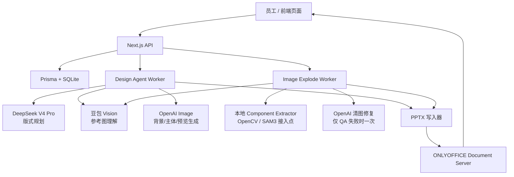
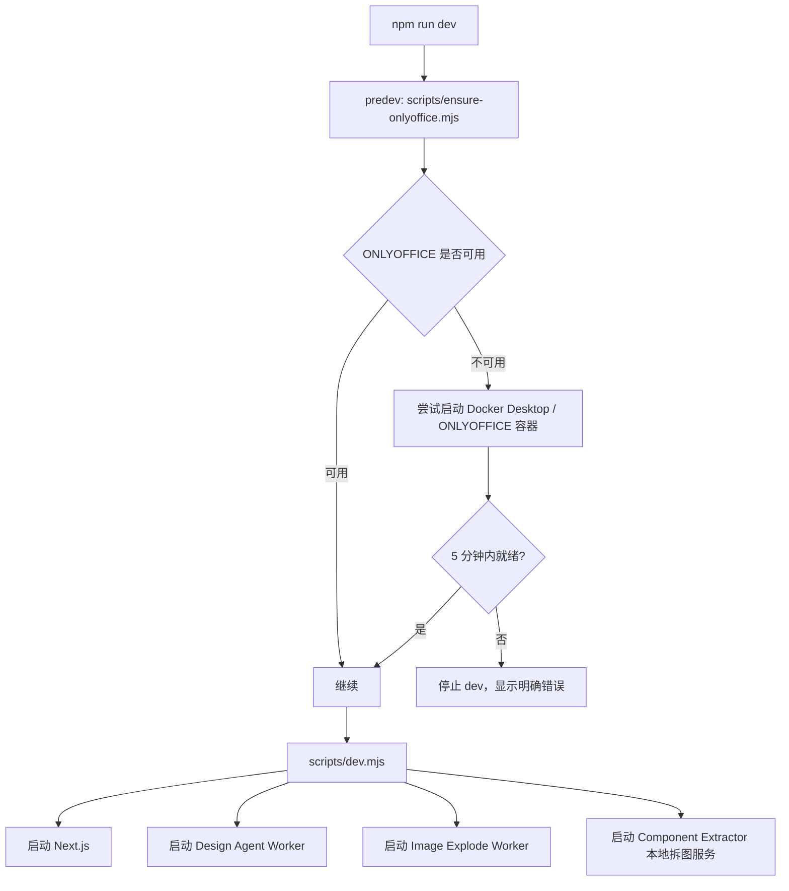
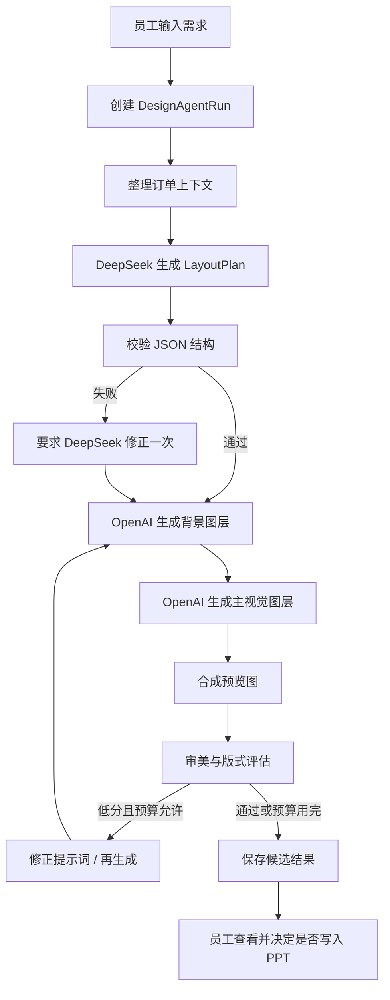
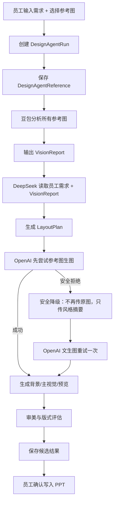
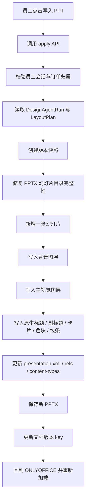
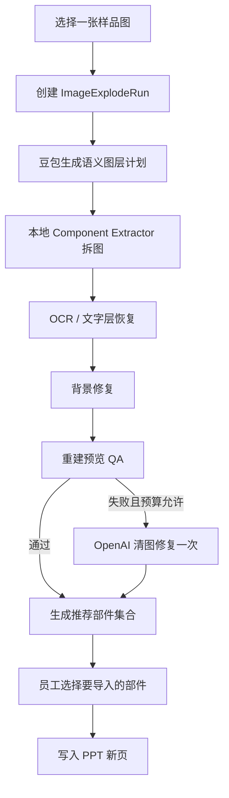

# AgentPlus：WZLCF PPT 智能体完整工作流程

更新时间：2026-06-25  
适用项目：`C:\Users\23722\Desktop\PPTagent`

这份文档写的是“现在这套智能体实际怎么工作”，不是遥远愿景。它包含当前已经搭起来的工作流、模型分工、后台 worker、PPT 写入逻辑、图片炸开逻辑、SAM3 当前状态，以及以后如果要继续升级，应该改哪里。

---

## 1. 一句话总结

当前 WZLCF 的 PPT 智能体不是一个“让大模型自由乱跑”的聊天机器人，而是一套：

```text
确定性工作流编排
  + 多模型决策节点
  + 图片生成工具
  + 视觉理解工具
  + 本地拆图执行器
  + PPTX 写入器
  + ONLYOFFICE 在线编辑器
```

它的核心目标是：

> 员工只描述需求或选择参考图，系统自动生成一张更好看的 PPT 页面，并尽可能把它变成可继续编辑的 PPT 对象，而不是只给一张死 PNG。

当前已经做到的是：

- 能在订单内创建“智能美化”任务。
- 支持文本模式和混合模式。
- 能调用豆包看图、DeepSeek 做版式规划、OpenAI 生成视觉素材。
- 能把结果写入 PPT 新页，不覆盖原页。
- 能把样品图拆成背景、主体、装饰、卡片、文字等候选部件。
- 已安装 SAM3 运行环境并支持 CUDA 检查，但 SAM3 权重尚未配置，因此目前还没有真正启用 SAM3 分割。

当前还没有完全做到的是：

- 还不能保证任意图片都像 WPS 那样一键完美炸开。
- 复杂艺术字、机械结构、渐变文字不会百分百变成原生可编辑矢量。
- “机器审美”还处在规则评分与候选修正阶段，不是成熟的自学习审美模型。
- SAM3 目前是“安装完成、可接入”，不是“已替代现有拆图算法”。

---

## 2. 当前智能体是不是一个 Agent？

从专业智能体工程角度看，它已经具备 Agent 的基本结构，但它不是完全自治型 Agent，而是更适合生产系统的“受控工作流智能体”。

它具备这些 Agent 构成：

| 智能体模块 | 当前实现 |
|---|---|
| 用户输入 | 员工在智能美化页输入需求、选择模式、上传或选择参考图 |
| 意图理解 | DeepSeek 根据订单、员工原话、参考图分析结果生成结构化设计计划 |
| 视觉感知 | 混合模式下由豆包分析参考图，图片炸开时也由豆包生成图层计划 |
| 任务规划 | DeepSeek 输出 LayoutPlan / 版式 JSON |
| 工具调用 | OpenAI 生图、豆包看图、本地 component extractor、PPTX 写入器 |
| 执行器 | `scripts/design-agent-worker.mjs` 与 `scripts/image-explode-worker.mjs` |
| 结果校验 | 设计候选评分、图片炸开重建 QA、PPTX 完整性修复 |
| 记忆 | 已有 `DesignPreferenceMemory` 数据结构，当前还没发展成成熟偏好学习 |
| 安全边界 | 不覆盖原页；写入前生成新页；密钥只在服务端；员工最终确认 |
| 日志追踪 | `DesignAgentEvent`、`ImageExplodeEvent` 记录每个阶段 |

它比较聪明的地方在于：不是单纯“问模型一句话”，而是把 PPT 设计拆成很多可以观察、重试、降级和回滚的阶段。

它还不够聪明的地方在于：目前审美评价、图层拆分、文字还原和自动排版仍然偏工程规则，没有形成稳定的“越做越懂你”的闭环。

---

## 3. 系统总架构

整体链路可以理解为：



主要代码位置：

| 模块 | 主要位置 |
|---|---|
| 员工端大组件 | `components/employee-app.tsx` |
| 智能美化 worker | `scripts/design-agent-worker.mjs` |
| 图片炸开 worker | `scripts/image-explode-worker.mjs` |
| 本地拆图服务 | `scripts/component-extractor.py` |
| 拆图服务启动脚本 | `scripts/component-extractor.mjs` |
| SAM3 检查脚本 | `scripts/check-sam3.mjs` |
| Grounded-SAM2 检查脚本 | `scripts/check-grounded-sam2.mjs` |
| PPT 写入逻辑 | `lib/pptx-design-slide.ts` |
| 数据模型 | `prisma/schema.prisma` |
| ONLYOFFICE 自动启动 | `scripts/ensure-onlyoffice.mjs` |
| 开发总启动 | `scripts/dev.mjs` |

---

## 4. 本地启动流程

现在本地目标是员工只运行：

```powershell
npm run dev
```

实际会发生这些事：



这样做的原因是：

- ONLYOFFICE 不在 Next.js 里面运行，它是 Docker 里的独立服务。
- 开发环境必须保证 ONLYOFFICE 先可用，否则 PPT 编辑器会出现假正常。
- 图片炸开服务也不是前端功能，它是本地 Python 服务。

---

## 5. 智能美化入口与 UI 状态

员工在订单工作台内进入智能美化页面。

当前 UI 中有几个关键入口：

- “智能美化”页面：用于输入需求、选择文本模式或混合模式。
- 小男孩数字人：作为智能体入口和品牌化交互。
- 左侧素材区：用于选择参考图或素材。
- 右侧任务列表：查看历史生成任务状态。
- 任务卡片：显示阶段进度、生成结果、可编辑结构、写入 PPT 按钮。

当前设计上有一个重要调整：

> 智能美化生成的结果，不再默认把整张预览 PNG 盲目图片炸开。

原因是之前“整图生成 → 整图炸开”很容易导致：

- 背景残影。
- 机器人、列车、标题重复。
- OCR 误把艺术字变成普通文字。
- 移动部件后露出脏背景。

现在更稳妥的方向是：

```text
先生成生产图层：
  背景图层
  主视觉图层
  原生 PPT 标题
  原生 PPT 副标题
  原生 PPT 卡片 / 色块 / 线条

再写入 PPT。
```

图片炸开仍然保留，但它更适合处理“客户原样图、素材图、AI 样片图”，而不是每次都自动拆智能美化结果。

---

## 6. 智能美化任务的数据结构

智能美化核心表是 `DesignAgentRun`。

一条 Run 大致代表：

> 某个员工对某个订单发起的一次 PPT 智能美化任务。

它保存：

- `generationMode`：`text` 或 `mixed`
- `status`：任务状态
- `brief`：员工输入的原始需求
- `visionReport`：豆包看图结果
- `layoutPlan`：DeepSeek 生成的结构化版式计划
- `designIntent`：整理后的设计意图
- `workflowState`：工作流内部状态
- `qualityMode`：质量模式
- `generationAttempts`：生图尝试次数
- `generationBudget`：预算限制
- `evaluationAttempts`：审美/质量评估次数
- `selectedImageId`：最终选择的预览图
- `visualPrompt`：最终用于生图的提示词
- `appliedSlideNumber`：写入 PPT 后的新页页码
- `events`：阶段事件
- `references`：参考图
- `evaluations`：评分记录

相关表：

| 表 | 作用 |
|---|---|
| `DesignAgentReference` | 保存每张参考图的来源、顺序、主参考标记 |
| `DesignAgentEvent` | 保存阶段进度，例如豆包看图、DeepSeek 规划、OpenAI 生图、写入 PPT |
| `DesignAgentEvaluation` | 保存质量评分、失败原因、修正建议 |
| `DesignPreferenceMemory` | 未来用于保存员工/客户偏好，目前还不是成熟学习系统 |

---

## 7. 文本模式完整工作流

文本模式适合员工只输入想法，不给参考图的情况。

流程如下：



文本模式里不会把参考图传给 OpenAI。

优点：

- 更安全，不容易触发参考图安全审核。
- 成本更可控。
- 适合“我要一个新风格封面”这类任务。

缺点：

- 不一定能继承客户原 PPT 的配色、构图和气质。
- 员工描述很长时，模型可能抓不住所有要求。
- 如果让 OpenAI 一次生成整页 PPT，很容易出现文字乱写、元素东一块西一块的问题。

所以当前已经把它改成更稳的做法：

> 不要求 OpenAI 一次画完整 PPT 页面，而是让它画背景和主视觉，文字、卡片、版式尽量由 PPT 原生对象完成。

---

## 8. 混合模式完整工作流

混合模式适合员工上传客户原 PPT 截图、参考图、素材图，希望 AI 继承视觉风格。

流程如下：



混合模式多了两个关键能力：

### 8.1 豆包看图

豆包负责理解参考图，而不是直接生成最终 PPT。

它提取：

- 主色调
- 行业气质
- 构图习惯
- 主体位置
- 信息密度
- 装饰元素
- 光影风格
- 不应复制的敏感内容

这些内容形成 `VisionReport`。

### 8.2 OpenAI 安全降级

之前混合模式遇到过 OpenAI 安全系统拒绝参考图请求。

当前策略是：

- 第一次仍然允许 OpenAI 看参考图。
- 如果被安全拒绝，就不再传客户原图。
- 改用豆包提取出的配色、版式、光影、风格摘要。
- 再调用 OpenAI 文生图接口重试一次。

这能减少任务直接失败的概率，也避免误导员工。

---

## 9. DeepSeek 在智能体里的角色

DeepSeek 不是用来生图的，它主要是“规划大脑”。

它负责把员工的自然语言转成结构化版式计划。

典型输出包括：

```json
{
  "pageType": "cover",
  "composition": "left-title-right-hero",
  "title": "轨探鳞甲",
  "subtitle": "基于具身智能的列车底盘多模态巡检机器人",
  "palette": ["#0B1E4A", "#2EA8FF", "#F4B13D"],
  "heroSubject": "railway inspection robot",
  "backgroundDirection": "deep blue technology background",
  "visualDirection": "premium industrial technology style",
  "body": [
    "参赛组别：XXX",
    "项目负责人：XXX",
    "联系方式：XXX"
  ]
}
```

为什么必须让它输出 JSON？

因为生产系统不能让模型一句散文决定所有后续动作。JSON 能被校验、修正、记录和复盘。

如果 JSON 不合格，worker 会最多让 DeepSeek 修正一次。

---

## 10. OpenAI 在智能体里的角色

OpenAI 当前主要负责图像生成。

现在不再把它当成“整页 PPT 生成器”，而更像一个视觉素材生产工具。

当前更稳的拆分是：

| 生成内容 | 是否推荐交给 OpenAI |
|---|---|
| 背景氛围图 | 推荐 |
| 主视觉机器人、人物、产品 | 推荐 |
| 艺术标题字 | 可选，但要谨慎 |
| 正文、电话、学校名 | 不推荐，容易错字 |
| 完整 PPT 页面 | 不推荐作为最终可编辑稿 |

原因很简单：

> 生图模型擅长画氛围和图像，不擅长生成可编辑、准确、稳定的 PPT 信息结构。

所以现在的方向是：

```text
OpenAI 负责画：
  背景
  主视觉
  氛围
  装饰图像

PPTX 写入器负责做：
  标题
  正文
  卡片
  色块
  线条
  信息结构
```

---

## 11. 质量评估与重试

当前智能体有基础的质量评估与自动修正。

它会看：

- 是否满足员工需求。
- 是否有明显缺失。
- 是否标题区混乱。
- 是否主体侵占文字区。
- 是否背景太空或太脏。
- 是否生成了不该出现的文字。
- 是否适合继续拆成 PPT 对象。

如果评分低，并且预算允许，会尝试修正一次。

当前这还不是成熟的“机器审美系统”。它更接近：

```text
规则检查 + 模型评价 + 预算内重试
```

未来应升级为分层评分：

- 需求适配
- 版式质量
- 品牌一致性
- 交付可编辑性
- 视觉保真度
- 员工接受率

---

## 12. 写入 PPT 的完整流程

员工点击“新增可编辑页”或“同步并打开 PPT”后，后端会把设计结果写入 PPTX。

流程如下：



写入原则：

- 永远追加新页。
- 不覆盖原始 PPT 页面。
- 写入前先做版本快照。
- 标题、正文、卡片、线条尽量是 PPT 原生对象。
- 主视觉图片仍然是可替换、可移动、可缩放的图片对象。
- 不承诺把机器人、人物、列车拆成机械臂、车轮、螺丝级别的矢量。

---

## 13. 图片炸开工作流

图片炸开是另一条工作流。

它的目标是：

> 把一张样品图拆成一组员工可选择的 PPT 零部件。

输入来源包括：

- AI 生成预成品
- 素材库图片
- 本地上传图片
- 客户 PPT 提取图

完整流程：



图片炸开的核心不是简单矩形裁剪，而是语义分层：

| 类型 | 处理方式 |
|---|---|
| 背景 | 尝试移除主体后修复 |
| 机器人 / 人物 / 列车 | 透明 PNG 部件 |
| 信息卡 / 框 / 标签 | 透明 PNG 或无字框 |
| 艺术字 | 默认保留原字效 PNG |
| 普通正文 | 尝试转成原生 PPT 文本 |
| 复杂渐变字 / 透视字 | 不强行转原生文字 |

---

## 14. 图片炸开的数据结构

图片炸开核心表是 `ImageExplodeRun`。

它保存：

- `sourceImageName`
- `sourceWidth`
- `sourceHeight`
- `layerPlanJson`
- `qaReportJson`
- `reconstructionName`
- `backgroundStrategy`
- `cloudCleanupUsed`
- `recommendedPartIds`
- `needsReview`
- `appliedSlideNumber`

子表包括：

| 表 | 作用 |
|---|---|
| `ImageExplodePart` | 每个图像部件，例如背景、机器人、列车、框、装饰 |
| `ImageExplodeTextLayer` | 每段文字层，含坐标、旋转、样式、模式 |
| `ImageExplodeEvent` | 阶段日志 |

`ImageExplodePart` 里有几个重要字段：

- `semanticId`：稳定语义身份
- `parentSemanticId`：父子关系
- `groupKey`：互斥组
- `kind`：类型
- `variant`：版本，例如原字效果版、无字可编辑版
- `x/y/width/height`：原图坐标
- `zIndex`：层级
- `confidence`：识别置信度
- `maskQuality`：蒙版质量
- `recommended`：是否推荐默认选择
- `selected`：员工是否选择

---

## 15. 当前拆图执行器如何工作

本地拆图服务在：

```text
scripts/component-extractor.py
```

启动入口是：

```text
scripts/component-extractor.mjs
```

它会优先选择 Python 环境：

1. `.venv-sam3`
2. `.venv-image-gpu`
3. 系统 Python

当前拆图执行器支持两条路径：

### 15.1 OpenCV / GrabCut 基线

这是当前真正可用的默认路径。

它能做：

- 基于图层计划裁剪候选区域。
- 通过 GrabCut 尝试生成透明蒙版。
- 对主体移除区域做背景修复。
- 输出透明 PNG 部件。

它的问题：

- 对蓝色科技风、发光线条、半透明元素不稳定。
- 容易把背景带进主体。
- 也容易把主体残影留在背景里。
- 不真正理解“这是机器人”“这是列车”“这是标题艺术字”。

### 15.2 SAM3 与 Grounded-SAM2 接入点

SAM3 目前已经安装了独立环境：

```text
.venv-sam3
```

检查命令：

```powershell
npm run components:sam3:check
```

权重配置命令：

```powershell
.\\.venv-sam3\\Scripts\\huggingface-cli.exe login
npm run components:sam3:setup
```

`facebook/sam3` 是 Hugging Face gated model，必须先登录并同意官方模型许可。`components:sam3:setup` 下载成功后，会把本机缓存中的 `sam3.pt` 路径写入 `.env` 的 `SAM3_CHECKPOINT`。

配置了权重后，可以做加载检查：

```powershell
npm run components:sam3:load-check
```

当前事实必须说清楚：

> SAM3 环境已安装，CUDA 能识别 RTX 4070，并且项目已有权重配置脚本；但当前机器还没有 Hugging Face 授权/缓存，因此权重尚未配置，仍没有真正用 SAM3 生成蒙版。

也就是说，现在系统不会假装 SAM3 已经生效。

因为 SAM3 权重是 gated model，如果授权失败，当前项目已经支持合法替代路线：Grounded-SAM2/SAM2。

检查命令：

```powershell
npm run components:gsam2:check
```

安装与配置命令：

```powershell
npm run components:gsam2:setup
npm run components:gsam2:load-check
```

当前 Grounded-SAM2 的落地策略是：

```text
豆包 / 视觉图层计划负责 grounding，也就是判断“应该抠哪些东西”和给出语义框；
SAM2 负责 segmentation，也就是根据语义框生成高质量蒙版。
```

这比 OpenCV 更接近“自动抠图执行器”，也比 SAM3 更容易落地，因为 SAM2.1 checkpoint 是公开下载路线。

未来启用 SAM3 仍需要：

- 核验官方许可证和商用条件。
- 获取或配置 SAM3 checkpoint / Hugging Face 权重。
- 设置环境变量，例如：

```env
COMPONENT_EXTRACTOR_BACKEND=auto
SAM3_CHECKPOINT=
SAM3_LOAD_FROM_HF=0
COMPONENT_EXTRACTOR_SAM3_CONFIDENCE=0.35
COMPONENT_EXTRACTOR_SAM3_USE_TEXT=0
```

当 SAM3 配置成功后，拆图服务会优先尝试 SAM3，失败时回退到 OpenCV。

现在新的后端顺序是：

```text
SAM3 可用 → 使用 SAM3
否则 Grounded-SAM2/SAM2 可用 → 使用 SAM2 蒙版
否则 → 回退 OpenCV / GrabCut
```

---

## 16. 文字还原逻辑

图片炸开中最难的不是抠图，而是“文字怎么办”。

当前正确策略是：

```text
框的视觉像素
  和
文字的可编辑内容
分成两层处理。
```

当前逻辑：

- 普通正文：尽量变成原生 PPT 文本框。
- 旋转标签：记录旋转角度，写入时还原。
- 艺术字、金属字、渐变字、描边字：默认保留为透明 PNG。
- 如果选择“原字效果版”，则不再额外导入 OCR 文本，避免重影。
- 如果选择“无字可编辑框”，才允许导入对应文字层。

这样做是为了避免之前出现的情况：

- 原图里已有字。
- OCR 又生成一层白色或黄色文字。
- 导入 PPT 后出现双字、错位、风格怪异。

---

## 17. 抠图精修逻辑

“抠图精修”不是用来回放原图怎么抠出来的，而应该是：

> 对当前已经识别出的某一个候选部件，再执行一次更高质量抠图，并把结果作为新候选追加到候选列表末尾。

当前产品方向：

- 不再叫“佐糖精修”，统一叫“抠图精修”。
- 员工点击某个候选的“抠图精修”。
- 右侧展示当前候选与精修结果。
- 员工确认后，把精修结果追加为新候选。
- 原候选不删除，避免误操作。

如果接入佐糖 API，它应该只在员工主动点击精修时消耗额度。

如果 SAM3 未来质量足够好，它可以替代大部分人工精修，让员工少点很多按钮。

---

## 18. ONLYOFFICE 在系统里的角色

ONLYOFFICE 是在线 PPT 编辑器。

它不负责 AI，不负责生图，也不负责拆图。它负责：

- 打开 PPT。
- 显示缩略图。
- 让员工编辑对象。
- 保存修改回服务器。

它是 Docker 独立运行的服务，本地端口通常是：

```text
http://localhost:18080
```

本地开发中，`npm run dev` 会先确保 ONLYOFFICE 已启动。

线上部署时，员工电脑不需要安装 Docker Desktop。Docker 应该只跑在服务器上，员工通过浏览器访问网站和 ONLYOFFICE。

---

## 19. 当前外部资源与模型分工

| 外部资源 | 用途 |
|---|---|
| DeepSeek V4 Pro | 版式规划、需求理解、结构化 JSON |
| 豆包 `doubao-seed-2-0-pro-260215` | 参考图理解、图层语义分析 |
| OpenAI 图片模型 | 背景图、主视觉、必要时清图修复 |
| ONLYOFFICE | 在线编辑 PPT |
| Docker Desktop | 本地启动 ONLYOFFICE |
| SAM3 | 已安装环境，未来作为高质量本地分割执行器 |
| OpenCV / GrabCut | 当前实际默认拆图基线 |
| PaddleOCR | 计划/可选文字识别能力，具体取决于本地环境是否安装 |
| Prisma + SQLite | 本地数据存储 |

密钥原则：

- API Key 只能在服务端环境变量里。
- 不暴露到浏览器。
- 不写入任务事件。
- 任务记录只保存模型名、阶段、耗时、错误摘要、生成文件名，不保存密钥。

---

## 20. 取消、失败与降级

当前工作流不是无限自动重试。

它有几个边界：

- OpenAI 安全拒绝：混合模式只自动降级重试一次。
- OpenAI 超时或网络失败：显示可操作错误，不无限重试。
- 图片炸开背景清理失败：保留候选，让员工确认，不自动导入错误背景。
- SAM3 不可用：回退到 OpenCV，不假装启用。
- 旧 ONLYOFFICE 会话：写入新版本后需要重新加载文档，避免旧编辑器状态覆盖新 PPT。
- 员工确认前：不覆盖原 PPT 页面，不自动发布给客户。

这套边界很重要，因为 PPT 代做服务不是玩具系统。一旦 AI 乱写真实订单，员工会失去信任。

---

## 21. 现在一条完整“智能美化 → 写入 PPT”的真实路径

以文本模式为例：

```text
1. 员工进入订单工作台。
2. 点击智能美化。
3. 输入需求。
4. 选择文本模式。
5. 前端调用创建 Run API。
6. 数据库创建 DesignAgentRun。
7. design-agent-worker 轮询到任务。
8. worker 整理订单上下文。
9. DeepSeek 生成 LayoutPlan。
10. worker 校验 LayoutPlan。
11. OpenAI 生成背景图层。
12. OpenAI 生成主视觉图层。
13. worker 合成预览图。
14. worker 做质量评估。
15. 如果评分低且预算允许，修正提示词再来一次。
16. 任务完成，前端轮询展示结果。
17. 员工点击新增可编辑页。
18. apply API 校验权限。
19. PPTX 写入器追加新幻灯片。
20. 背景、主视觉、标题、卡片、正文分别写入。
21. 保存 PPTX 并刷新 ONLYOFFICE。
22. 员工在新页中继续编辑。
```

混合模式只是在第 8 步后多了：

```text
豆包分析参考图 → 生成 VisionReport → DeepSeek 带着 VisionReport 规划。
```

---

## 22. 现在一条完整“图片炸开 → 导入 PPT”的真实路径

```text
1. 员工进入图片炸开工作台。
2. 选择 AI 样片、素材库图或上传图。
3. 前端创建 ImageExplodeRun。
4. image-explode-worker 轮询到任务。
5. 豆包读取图片，输出语义图层计划。
6. 本地 component-extractor 根据图层计划拆图。
7. OpenCV 或未来 SAM3 生成透明部件。
8. OCR / 视觉语义尝试还原文字层。
9. 生成背景修复图。
10. 合成重建预览并做 QA。
11. 如果背景明显残影且预算允许，OpenAI 清图一次。
12. 保存候选部件、文字层、重建预览。
13. 前端展示智能推荐候选。
14. 员工勾选部件。
15. 员工可对单个候选做抠图精修。
16. 点击导入新页。
17. PPTX 写入器按原坐标写入背景、图片部件和文字层。
18. ONLYOFFICE 重新加载，员工继续编辑。
```

---

## 23. 如果要修改，应该改哪里？

### 23.1 想改智能体提示词

主要看：

```text
scripts/design-agent-worker.mjs
```

重点函数：

- `makePlan()`
- `backgroundPrompt()`
- `visualPrompt()`
- `evaluateCandidate()`
- `buildRevisionPrompt()`

如果是图片炸开语义识别，看：

```text
scripts/image-explode-worker.mjs
```

重点函数：

- `analyze()`
- `normalizeLayerPlan()`
- `cleanBackgroundWithOpenAi()`

### 23.2 想改 PPT 写入效果

主要看：

```text
lib/pptx-design-slide.ts
```

重点方向：

- 新增页尺寸
- 背景图位置
- 主视觉位置
- 标题字体
- 卡片样式
- 线条和色块
- 图片炸开对象写入顺序
- 文字层旋转和样式

### 23.3 想改前端交互

主要看：

```text
components/employee-app.tsx
```

重点组件：

- `DesignStudio`
- `ImageExplodeStudio`
- 任务卡片
- 候选部件选择
- 抠图精修面板
- 返回 PPT 编辑器逻辑

### 23.4 想改数据结构

主要看：

```text
prisma/schema.prisma
```

改完后通常需要：

```powershell
npm run db:init
```

或者按项目迁移策略生成/应用 Prisma migration。

### 23.5 想改模型和密钥

主要看 `.env`。

常见变量：

```env
OPENAI_API_KEY=
OPENAI_IMAGE_MODEL=
OPENAI_PROXY_URL=

DEEPSEEK_API_KEY=
DEEPSEEK_TEXT_MODEL=

DOUBAO_API_KEY=
DOUBAO_VISION_MODEL=

COMPONENT_EXTRACTOR_BACKEND=auto
SAM3_CHECKPOINT=
SAM3_LOAD_FROM_HF=0
```

---

## 24. 当前最大短板

### 24.1 生图模型不应该负责完整 PPT

之前效果差的核心原因之一是：

> 让生图模型一次画完整 PPT 页面，它会把文字、主体、背景、卡片混在一张图里。

这样很难编辑，也很难拆。

更稳定路线是：

```text
背景单独生成
主体单独生成
文字原生写入
卡片原生写入
最后由 PPTX 写入器组合
```

### 24.2 图片炸开不能只靠 OpenCV

OpenCV 对科技蓝、发光边缘、半透明元素不够懂。

SAM3 的价值在于：

> 它可能提供更高质量对象蒙版，减少人工逐张精修。

但 SAM3 不是审美大脑，它只是分割执行器。

### 24.3 审美评价还不够成熟

现在能做基础评分，但还不能像专业设计总监一样稳定判断：

- 哪个版式高级。
- 哪个颜色更符合行业。
- 哪个信息层级更清晰。
- 哪个图像对客户更有说服力。

未来需要做基准集和反馈闭环。

### 24.4 文字还原仍是难题

普通文字可以做成原生文本框。

但这些内容不适合强行转原生：

- 金属立体字
- 渐变艺术字
- 描边字
- 透视字
- 弧形字
- 图片纹理字

它们应该默认作为“原字效透明 PNG”保留。

---

## 25. 下一阶段最值得做的升级

我建议下一阶段不要继续堆更多模型，而是做这几件硬工程：

### 25.1 启用并评测 SAM3

目标不是“装上就完事”，而是建立基准：

- 科技封面
- 人物海报
- 产品页
- 数据图表
- 教育医疗页
- 复杂中文艺术字
- 半透明信息框

记录：

- 直接可用比例
- 小改可用比例
- 不可用比例
- 是否比 OpenCV 明显提升

只有达标后，SAM3 才应该成为默认后端。

### 25.2 建立“样片 → 背景 → 主体 → 原生文字”的稳定生成 skill

也就是把生成过程制度化：

```text
需求
  → 版式计划
  → 背景专用提示词
  → 主体专用提示词
  → 原生文字与卡片计划
  → PPT 写入
```

不要再让 OpenAI 一次生成完整 PPT 页面。

### 25.3 做重建预览 QA

图片炸开后，在导入 PPT 前先自动合成一张重建预览：

```text
背景 + 部件 + 文字层 = 重建预览
```

然后检查：

- 背景是否有残影
- 标题是否重复
- 机器人是否重复
- 列车是否重复
- 文字是否压住主体
- 信息框是否错位

这个 QA 比“生成更多图片”更重要。

### 25.4 让员工反馈变成记忆

员工每次选择、删除、移动、替换，都应该记录成结构化偏好：

- 哪个风格被接受
- 哪个标题样式被拒绝
- 哪类客户喜欢科技蓝
- 哪类页面适合低信息密度
- 哪个模型生成的机器人经常不可用

这些反馈未来才是真正的“智能体变聪明”。

---

## 26. 验证命令

常用验证：

```powershell
npm run lint
npx tsc --noEmit
npm run build -- --webpack
```

ONLYOFFICE 与开发启动：

```powershell
npm run dev
```

SAM3 环境检查：

```powershell
npm run components:sam3:check
```

SAM3 权重加载检查：

```powershell
npm run components:sam3:load-check
```

---

## 27. 最终判断

当前这套智能体已经不是一个普通 AI 聊天框，而是一个真正朝“PPT 生产智能体”发展的系统。

它现在最强的地方是：

- 工作流已经拆开。
- 每个阶段可追踪。
- 能写入真实 PPT。
- 能连接 ONLYOFFICE。
- 能做图像生成和图片炸开。
- 已经开始考虑可编辑性，而不是只追求好看的 PNG。

它现在最需要提升的地方是：

- 分割质量。
- 文字还原。
- 审美评分。
- 生成策略稳定性。
- 员工反馈记忆。
- GPU worker 与生产部署。

从工程路线看，正确方向不是做一个“看起来很智能、实际乱跑”的全自动大模型，而是继续把它建设成：

```text
有审美目标
有预算控制
有工具执行
有失败降级
有版本快照
有员工确认
有反馈学习
的 PPT 生产智能体。
```

这条路更慢一点，但它能真正变成员工离不开的生产工具。
