# WZLCF 审美闭环智能体：工程说明

## 一句话定义

这不是一个让大模型随意“想下一步做什么”的聊天机器人，而是一个**确定性设计工作流**：每一环由程序控制状态、预算、取消、重试和版本；模型只在受约束的节点输出结构化设计判断。

员工提交需求和参考图后，系统自动完成理解、版式规划、主视觉候选、质量评估、图片拆解与可编辑重建准备；员工只在最终确认阶段决定是否把新页写入 PPT。原页不会被覆盖，也不会自动发布给客户。

## 当前架构

```mermaid
flowchart LR
  A["员工需求 / 订单 / 参考图"] --> B["DesignAgentRun 工作流"]
  B --> C["设计意图 DesignIntent"]
  C --> D["DeepSeek LayoutPlan"]
  D --> E["OpenAI 主视觉候选"]
  E --> F["豆包分层设计评估"]
  F -->|"通过 / 选优"| G["图片炸开任务"]
  F -->|"低分且预算允许"| E
  G --> H["OCR 文字层 + 分割适配器"]
  H --> I["员工确认"]
  I --> J["PPT 版本快照 + 新增可编辑页"]
  J --> K["DesignPreferenceMemory 偏好记忆"]
```

### 工作流与模型的边界

| 由确定性程序负责 | 由模型负责 |
| --- | --- |
| 状态流转、取消、失败恢复、幂等、版本快照 | 设计意图、LayoutPlan、视觉分析、质量评分、修正建议 |
| 生图/评估次数预算、每小时限额、任务归属校验 | 在 JSON Schema 中给出结构化结果 |
| 选中候选图、写入 PPT、保存审计事件 | 不直接写文件、不直接决定发布、不直接覆盖原 PPT |

这样做的原因很简单：模型会犯错，但“创建了几张图、花了多少、PPT 是否被改写”必须始终可预测、可追踪、可恢复。

## 已实现能力

### 1. 结构化设计决策

每个 `DesignAgentRun` 会保存：设计意图、LayoutPlan、生成模式、质量策略、生成次数/预算、评估次数、最终选中的图片、阶段事件和最终 PPT 页码。

`DesignAgentEvaluation` 不用单一“好看分”判断。它分别记录：

- 需求适配：是否表达订单目标、行业、重点；
- 信息层级：标题、主体、信息区是否清楚；
- 版式与留白：是否对齐、是否拥挤、文字安全区是否被侵占；
- 品牌一致性：颜色和气质是否匹配；
- 可读性、可编辑性与视觉保真度。

总分是明确的加权规则，不是模型一句“我觉得很好看”。低于阈值、出现关键问题时，才会在预算内生成一次修正候选；高质量模式会主动比较两版。每次选择和原因保存在事件与评估记录中。

### 2. 自动图片炸开与文字还原

主视觉选定后会自动创建拆图任务。拆图工作流生成背景、主体、框、卡片、装饰等候选，并用 PaddleOCR（不可用时退回视觉模型）提取文字内容、坐标和旋转。

含文字框有两条路径：

- **无字可编辑版**：框图擦除文字，导入后叠加原生 PPT 文本；
- **原字效果版**：保留复杂渐变字、透视字或艺术字，避免不可靠的重建导致视觉损失。

复杂人物、机器人、列车等仍是透明 PNG 零部件，可移动、缩放、替换；它们不是承诺能被分解成机械零件的矢量路径。

### 3. 可编辑 PPT 与安全写入

确认写入时，系统先创建版本快照，再新增一页；文字、色块、卡片和线条按 LayoutPlan 变为 PPT 原生对象，复杂主视觉以可替换图片保存。ONLYOFFICE 旧会话不能覆盖新版本。

### 4. 偏好记忆，而不是伪训练

员工把方案写入 PPT 后，系统保存 `DesignPreferenceMemory`：行业、页型、视觉方向、配色、最终结果及相关信号。下一次同类订单规划时，系统检索已被接受的偏好作为提示。

这叫“结构化记忆”，不是用几十个案例假装训练出了审美模型。只有积累足够的、经过客户确认的真实样本，才适合训练排序器或偏好模型。

## SAM3 的位置

当前拆图服务以 OpenCV 为稳定基线，并已经暴露 `SegmentationAdapter` 配置边界：`COMPONENT_EXTRACTOR_BACKEND=auto|sam3`。

SAM3 **尚未被宣称为已启用的默认能力**。在下面事项没有验证前，服务会安全地继续使用 OpenCV：

1. 官方代码、模型权重和商用许可证；
2. CUDA/PyTorch 版本、显存占用、4070 的稳定性；
3. 对真实样品集的对象掩码质量；
4. 生产 GPU 容器的启动、健康检查、失败回退。

通过基准测试后，SAM3 只替换“生成物体蒙版”这一个执行节点；它不替换 LayoutPlan、OCR、文字还原、PPT 写入或质量决策。这样模型换代不会重写整个系统。

## 还没有假装完成的能力

1. **PPT 渲染回图片后的 SSIM/区域差异报告**：需要稳定的服务器渲染器（例如专用 LibreOffice 容器或经过验证的转换服务）。当前 Windows 开发环境未配置该渲染器，因此不能诚实地声称已完成逐像素 QA。
2. **SAM3 真正推理**：目前是适配器接口和安全回退，等待许可证、GPU 和基准验证。
3. **自动发布**：刻意不做。智能体最多生成草稿与候选，员工始终拥有最终确认权。
4. **审美模型训练**：先收集接受/拒绝、人工调整和客户确认信号；数据量不足时只做检索记忆。

## 建议的实施顺序

1. 建立至少 30 张脱敏真实页面的基准集：科技、教育、人物、产品、数据页、复杂框、中文文字。
2. 为每张样品标记：需求、LayoutPlan、关键区域、可编辑目标、员工是否接受。
3. 跑现有 OpenCV 拆图与文字还原，量化“直接接受/只需小改/不可用”的比例。
4. 对同一基准集接入候选 SAM3 适配器，比较对象轮廓、半透明装饰、细线框、人物/产品边界，再决定是否默认启用。
5. 部署独立 PPT 渲染 QA 服务，按标题区、主体区、卡片区、文字安全区做局部差异检查；SSIM 只做结构保真指标，不评判美感。
6. 收集足够客户确认数据后，再训练内部排序器；在此之前只使用可解释规则和偏好检索。

## 如何修改系统

- 修改模型输出字段：优先改 `normalizePlan`、评估 JSON Schema 和 Prisma 记录字段，随后更新 worker 与 API；不要让模型自由返回未验证文本。
- 修改质量阈值/权重：在 `scripts/design-agent-worker.mjs` 的 `normalizeEvaluation` 中调整并记录版本号；应先在基准集回放。
- 修改是否重试：只改确定性的条件与 `generationBudget`，不要交给模型“自己决定再画几张”。
- 更换分割模型：实现同一 `SegmentationAdapter` 输入输出协议，并先在基准集比较；不要把模型调用散落到页面或业务 API。
- 修改 PPT 重建：改写入计划和 PPTX 层，保留“版本快照 → 新增页 → 重新加载”的安全边界。

## 成功标准

真正的成功不是“模型链路看起来很长”，而是：员工少点很多次按钮、能解释每一次自动决定、失败能安全恢复、成本可控、原稿不丢失，并且真实订单中“直接接受或只需小改”的比例持续上升。
