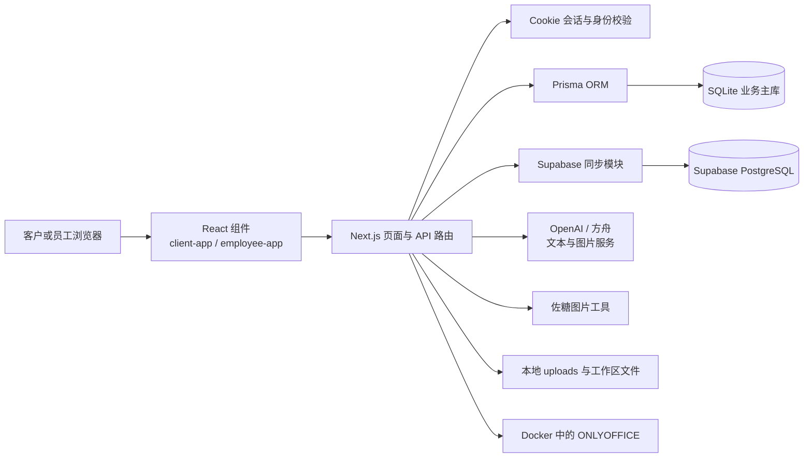
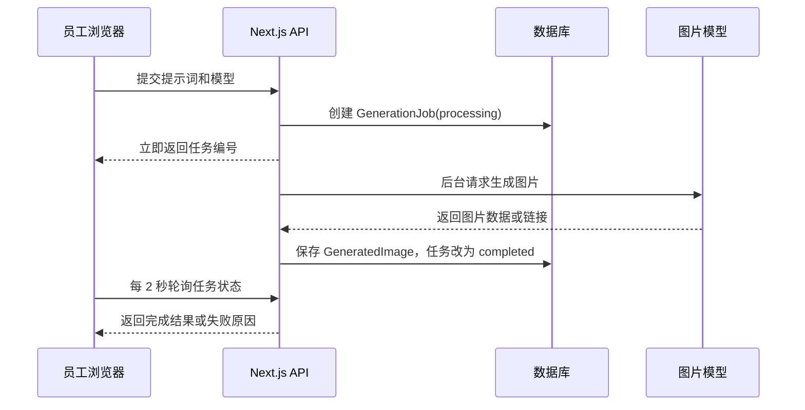
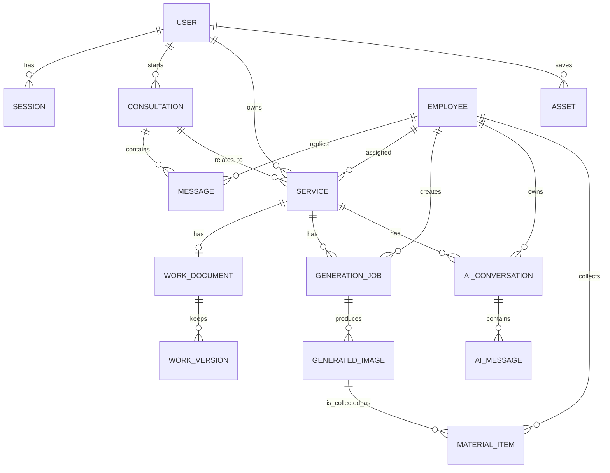

# WZLCF 项目设计与学习手册

> 读者：有一点 Python 基础、正在学习网页开发的你。  
> 目标：读完后，你能说明这个项目为何存在、每一层代码负责什么、一次点击如何流经前端与后端，以及下一次自己改功能时应从哪里下手。

## 1. 先用一句话认识项目

**WZLCF 是一个把 PPT 定制服务流程数字化的网站。**

它不是单纯的展示页，而是同时服务两类人：

| 角色 | 要解决的问题 | 主要能力 |
| --- | --- | --- |
| 客户 | 不想在多个聊天软件、文件夹和表格之间追踪需求与交付 | 登录、选择预算、咨询、上传附件、查看进度、申请修改、保存资产 |
| 员工 | 需要把客户沟通、订单进度、PPT 编辑、图片创作和素材管理放在一个工作流中 | 订单任务、消息协作、AI 助手、ONLYOFFICE、素材库、图片工具 |

这就是产品设计上的主线：**客户看到清楚、可信赖的服务过程；员工得到集中、可追踪的生产工作台。**

### 从一次操作看全局

例如客户点了一个预算档：

1. React 前端调用 `POST /api/consultations`。
2. Next.js 的服务端路由确认当前 Cookie 中的用户身份。
3. Prisma 把咨询群、预算和系统消息写入 SQLite。
4. 服务端再尝试把用户和预约信息同步到 Supabase，作为外部记录库。
5. 前端拿到最新咨询数据，打开客户专属咨询群。

这条链路已经包含了现代全栈项目最重要的四层：**界面、接口、业务规则、数据存储**。

## 2. 技术栈：每个工具为什么在这里

| 技术 | 在项目中的位置 | 你可以把它理解成 |
| --- | --- | --- |
| Next.js 16 | `app/` 和 API 路由 | 同时能做网页页面和后端接口的框架 |
| React 19 | `components/` | 用组件和状态组织交互界面 |
| TypeScript | `.ts` / `.tsx` | 给 JavaScript 加上类型提示和错误预防 |
| Prisma 6 + SQLite | `prisma/`、`lib/db.ts` | 让代码用对象方式读写本地关系数据库 |
| PostgreSQL / Supabase | `lib/supabase-postgres.ts`、`supabase/` | 服务端同步注册与预约记录的外部数据库 |
| Framer Motion | 客户端组件 | 页面过渡、卡片动效和更细腻的交互 |
| Lucide React | 组件中的图标 | 统一的图标库，而不是手画 SVG |
| Docker + ONLYOFFICE | `docker-compose.onlyoffice.yml` | 在本机容器中运行在线 PPT 编辑器 |
| OpenAI / 火山方舟 / 佐糖 | `lib/ai-providers.ts`、图片接口 | 文本、图片生成与图片处理能力 |

### 一个重要概念：框架不是“自动做事”

框架只提供规范和工具。例如 Next.js 知道 `app/api/auth/verify/route.ts` 是一个接口文件，但它不知道验证码怎么验证、用户如何创建、Cookie 怎样设置。这些业务规则仍然由项目代码定义。

## 3. 仓库导览：看到目录就知道该往哪里找

```text
PPTagent/
├─ app/              页面入口与后端 API 路由
├─ components/       客户端与员工端的 React 界面组件
├─ lib/              可复用的业务能力：鉴权、数据库、AI、文件、短信等
├─ prisma/           SQLite 数据模型定义
├─ scripts/          初始化、启动依赖、同步和视觉测试脚本
├─ onlyoffice/       ONLYOFFICE 文档服务器配置
├─ public/           浏览器可直接访问的品牌资源和插件文件
├─ supabase/         PostgreSQL 建表迁移文件
├─ AGENTS*.md        历次需求和决策记忆
└─ .env              本机密钥与环境变量，不能提交或公开
```

### 各目录真正的职责

| 目录 | 关键内容 | 修改它的典型场景 |
| --- | --- | --- |
| `app/` | `/`、`/employee` 页面入口；`app/api/**/route.ts` 接口 | 新增页面、增加后端能力、修改接口返回值 |
| `components/` | `client-app.tsx`、`employee-app.tsx` | 修改客户或员工看到的界面、按钮、状态和交互 |
| `lib/` | `auth.ts`、`employee-auth.ts`、`workspace-storage.ts` 等 | 提取重复逻辑、处理安全、调用第三方服务 |
| `prisma/` | `schema.prisma` | 新增表、字段、关系或唯一约束 |
| `scripts/` | `init-db.mjs`、`ensure-onlyoffice.mjs` 等 | 初始化数据库、启动依赖、同步外部记录 |
| `public/` | 品牌标志、ONLYOFFICE 插件静态文件 | 浏览器需要直接下载的资源 |

## 4. 总体架构：数据如何流动



### 三条安全边界

1. **浏览器不能拿到密钥。** `OPENAI_API_KEY`、`ARK_API_KEY`、`TECHSZ_API_KEY`、Supabase 连接串都只能出现在服务端 `.env`。
2. **浏览器不能直接相信。** 任何重要接口先检查当前用户或当前员工会话，再读写数据。
3. **界面禁用不是最终防线。** 例如资产只能由已完成订单创建，后端接口也会再次判断，不能只靠按钮变灰。

## 5. 客户端：从登录到资产的完整业务流程

客户端主要在 `components/client-app.tsx`，对应页面数据接口位于 `app/api/`。

### 5.1 验证码登录

流程：手机号输入 -> 请求验证码 -> 验证码校验 -> 写入会话 Cookie -> 刷新 `/api/me` -> 进入工作台。

这里有一个很值得学习的细节：输入框同时使用 `ref`、`onInput` 和 `onChange`。原因是某些浏览器自动填充手机号时，页面看起来有值，但 React state 不一定同步，按钮会错误地保持禁用。提交前再次从真实 DOM 输入框读取值，是对浏览器行为差异的防御。

当前开发环境默认使用 `SMS_PROVIDER="mock"` 和验证码 `123456`；只有配置为 `aliyun` 才调用真实阿里云短信。README 中仍有旧的腾讯云标题，它不是当前实现的准确信息。

### 5.2 预算与客户专属咨询群

客户选择预算时，不再为每个预算创建一条新会话。现在的规则是：

- 每个用户最多复用一个 `isCustomerGroup=true` 的客户咨询群。
- 第一次选择预算时创建咨询群。
- 再选其他预算时，把预算追加到 `selectedBudgets`，并写入一条系统消息。

这体现了一个数据库设计思想：**把“客户是谁”和“客户选过哪些预算”分开建模**。客户身份在 `User`，会话在 `Consultation`，多个预算用 JSON 字符串保存为一组值。

### 5.3 附件、交付、修改与资产

- 客户消息可附带 PPT、PDF、Office 文件、图片和 ZIP；前端限制一次最多 5 个、总量不超过 100MB。
- 服务交付页展示状态、进度、价格和封面。
- “申请修改”回到原咨询群，让修改意见仍然跟原始需求关联。
- 完成订单可转为资产；`Asset.serviceId` 是唯一值，所以同一订单不能保存两次。

你可以把它理解成电商中的“订单 -> 售后 -> 收藏”，只是领域换成了 PPT 服务。

## 6. 员工端：把服务工作流放到同一个界面

员工端入口是 `/employee`，核心界面在 `components/employee-app.tsx`。

### 6.1 员工身份与权限

员工登录需要手机号、8 位员工码和验证码。数据库里的 `Employee` 有 `isAdmin` 与 `enabled` 两个重要字段：

- `isAdmin` 决定能否管理员工和更广的订单操作。
- `enabled` 决定员工身份是否可继续使用。

固定员工码只是当前演示和内部管理方案，不等同于生产级账号体系。真实上线还应加入更强的密码、权限审计和员工邀请机制。

### 6.2 客户消息与未读数

员工端所有启用员工都能看到客户咨询，形成团队协作模式。客户连续发了几条消息，头像角标就显示几条；只有真正的员工回复，即 `role === "advisor"` 且带有 `employeeId`，才清零。

为什么要这样写？因为系统消息、机器人消息不代表有人处理了客户问题。

另一个细节是“静默刷新”。员工发消息后调用 `refresh(true)` 更新数据，而不是让整个页面进入加载状态。这样当前选中的会话不会被卸载重建，自然也不会跳回列表第一条。这是 React 状态生命周期与用户体验结合的例子。

### 6.3 订单、版本与状态

员工可分配负责人、建立工作文档、保存版本、发布确认稿、完成订单。相关数据包括：

- `Service`：订单本身。
- `WorkDocument`：当前在线编辑的 PPT 文件。
- `WorkVersion`：员工手动保存的版本快照。
- `ServiceActivity`：谁在何时做了什么操作。

这使得“当前文件是什么”和“历史上做过什么”不混在一起。

## 7. AI、图片与素材：一个异步生产链路

### 7.1 员工独立 AI 对话

AI 对话使用 `AiConversation` 与 `AiMessage`。最关键的约束是：

```text
一个 AI 会话 = 一个订单 serviceId + 一个员工 employeeId
```

因此同一订单的两个员工，不会互相看到 AI 聊天记录。文本模型可从火山方舟的 DeepSeek、Doubao 与 OpenAI 选取；后端会把订单标题、状态、客户尾号、当前 PPT 等上下文组织成提示词，再发送给模型。

### 7.2 为什么图片生成要做成任务

文本回答通常很快，图片生成却可能等待几十秒甚至更久。如果浏览器一直等着同一个 HTTP 请求，网络、网关或浏览器可能超时。

因此图片生成采用：



当前代码支持方舟 Seedream 5.0 与 OpenAI 图片模型。OpenAI 图片模型可以带参考图；方舟 Seedream 的当前界面不提供参考图入口。出现失败时，界面保留原提示词，便于修改后重试。

### 7.3 素材库为什么要分两层

- **我的素材库**：只显示当前员工收藏的图片，避免多人工作时互相干扰。
- **订单素材总库**：查看该订单中所有员工收录的素材，可复制一份到自己的库。

`MaterialItem` 通过 `employeeId + imageId` 唯一约束保证同一员工不会重复收藏同一张图。图片本体在 `GeneratedImage`，收藏关系单独放在 `MaterialItem`，这就是关系数据库中“实体”和“关系”分离的典型写法。

### 7.4 图片工具与 PPT 提取

图片工具目前包含：

- 智能抠图：佐糖 `visual/segmentation`。
- 图片变清晰：佐糖 `visual/scale`。
- PPT 提取：从当前服务端保存的 `.pptx` 中解析普通图片对象。

PPT 提取会读取图片关系和 `a:srcRect`。`a:srcRect` 是 PPT 对原图的裁剪比例；前端使用 canvas 把原图按比例裁成可见区域预览。它能处理基础矩形裁剪，但不承诺还原阴影、形状蒙版、旋转、组合对象或复杂透明效果。

## 8. ONLYOFFICE、PPT 文件与浏览器限制

### 8.1 Docker 在这里做什么

ONLYOFFICE Document Server 不在 Next.js 里运行，而是通过 Docker 容器启动。项目把宿主机端口映射为 `18080:80`，`npm run office:up` 会检查 Docker Desktop、启动容器，并等待编辑器脚本可访问。

员工打开工作台时，前端先请求工作文档配置，再动态加载 ONLYOFFICE 的脚本。PPT 文件存于工作区目录，ONLYOFFICE 通过带签名的文件 URL 获取它，并用回调接口保存编辑结果。

### 8.2 为什么网页图片不能保证直接粘进 PPT

Windows 文件管理器复制的图片和网页通过 JavaScript 写入剪贴板的图片，底层格式并不完全相同。ONLYOFFICE 在某些浏览器中会接受网页图片，但也可能只粘贴一个空框。

项目仍保留 `PPT 粘贴托盘`：先写入 `image/png`，失败时再降级为 HTML 图片复制。但这是一种兼容尝试，不应向用户承诺百分之百成功。

仓库里还保留了 ONLYOFFICE 图片桥接插件和 `insert-image` 的服务端 PPTX 写入能力。它们是对浏览器限制的探索和兜底，不是当前主界面强依赖的图片插入路径。当前界面只会对真正拖入的 `.ppt/.pptx` 文件显示加载提示，不再用整屏吸附层误导用户把普通图片拖到画布。

## 9. 数据模型：用关系图读懂数据库



### 关系数据库的四个实用原则

1. 不要把所有东西都塞进一张表；用户、订单、消息、图片各自有自己的生命周期。
2. 用外键表达归属，例如消息的 `consultationId` 表示它属于哪个咨询群。
3. 用唯一约束保护业务规则，例如一个订单只能有一份当前 `WorkDocument`。
4. 用索引提高常用查询速度，例如按员工和订单查素材、按会话和时间查 AI 消息。

## 10. 配置、运行和验证

### 常用命令

```powershell
# 首次准备本地数据库
npm run db:init

# 启动开发服务器
npm run dev

# 启动或检查 ONLYOFFICE
npm run office:up

# 校验代码风格与类型
npm run lint
npx tsc --noEmit

# 构建生产版本
npm run build -- --webpack

# 建立或补同步 Supabase 记录
npm run supabase:migrate
npm run supabase:sync
```

### `.env` 中应该理解的几类变量

| 分类 | 变量示例 | 注意事项 |
| --- | --- | --- |
| 数据库 | `DATABASE_URL`、`SUPABASE_DATABASE_URL` | 连接串只能在服务端 |
| 登录 | `SMS_PROVIDER`、`DEV_SMS_CODE`、阿里云短信变量 | 开发环境默认 mock |
| AI | `ARK_API_KEY`、`OPENAI_API_KEY`、`OPENAI_PROXY_URL` | 不要写进前端或截图 |
| 图片工具 | `TECHSZ_API_KEY` | 仅服务端调用佐糖 |
| Office | `ONLYOFFICE_URL`、`ONLYOFFICE_JWT_SECRET` | 修改后重启开发服务器 |

如果修改 `.env`、`next.config.ts` 或 Docker 配置，请先停止并重新运行 `npm run dev`，然后在浏览器按 `Ctrl + F5` 强制刷新。

## 11. 作为学习者，你能从项目里学到什么

### React 与 TypeScript

- 用 `useState` 保存界面变化，例如当前页面、输入内容、加载状态。
- 用 `useEffect` 在组件出现时获取数据、轮询任务、清理定时器。
- 用 props 把父组件的数据和动作传给子组件。
- 用 TypeScript 的 type/interface 先说明数据长什么样，减少“字段拼错但运行时才发现”的问题。

### 前后端接口

- `fetch` 发送请求，`route.ts` 接收请求。
- `GET` 通常读取，`POST` 通常创建，`PATCH` 通常更新，`DELETE` 通常移除。
- 前端的按钮状态是体验；后端校验才是安全。

### 数据库与异步任务

- Prisma 把数据库表映射为代码中的模型。
- 关系、索引、唯一约束不是“数据库语法作业”，而是业务规则的长期保障。
- 图片生成用任务状态和轮询，适合耗时、不稳定的外部服务。

### 工程习惯

- 密钥进入 `.env`，不要硬编码，也不要把它发到聊天或 Git。
- 文件上传要限制类型和体积。
- 接入外部服务要给出可读的错误信息。
- 修改后运行 lint、类型检查和构建；不要只看页面“好像能打开”。
- 先阅读现有模式，再改动代码，避免破坏已经解决的问题。

## 12. 当前限制与下一步建议

| 现状 | 原因 | 合理的下一步 |
| --- | --- | --- |
| 网页复制图片到 ONLYOFFICE 可能空框 | 浏览器剪贴板格式与系统文件剪贴板不同 | 继续研究官方插件，或设计明确的文件导入流程 |
| PPT 提取只还原基础裁剪 | PPT 对象效果非常复杂 | 按页码筛选、批量收录，或引入渲染截图能力 |
| ONLYOFFICE 插件桥接保留但稳定性有限 | 插件加载和编辑器环境受版本影响 | 将其视作实验能力，先以稳定工作流为主 |
| README 短信标题仍提腾讯云 | 文档未跟上实现变更 | 后续统一更新为阿里云 / mock 方案 |
| 当前开发凭据和员工码偏演示用途 | 项目仍在本地开发阶段 | 上线前加入更严格的账户、权限、审计与部署方案 |

## 13. 建议的阅读顺序

不要一上来就读完 1400 多行的员工组件。建议按下面顺序：

1. 读 `package.json`，知道项目如何启动。
2. 读 `prisma/schema.prisma`，先认识数据对象与关系。
3. 读 `components/client-app.tsx`，从用户看得见的流程理解 React。
4. 跟着某个 `fetch("/api/...")` 打开对应 `route.ts`，学习一次完整请求。
5. 再读 `components/employee-app.tsx` 中的 `Workspace`、`AiPanel`、`ImageToolsPanel`、`MaterialRail`。
6. 最后读 `lib/ai-providers.ts`、`lib/workspace-storage.ts`、`scripts/ensure-onlyoffice.mjs`，理解外部服务和运行环境。

学代码最有效的方式不是背语法，而是反复问：**这份数据从哪里来？谁可以修改它？修改后谁会看到它？失败时用户会看到什么？**
